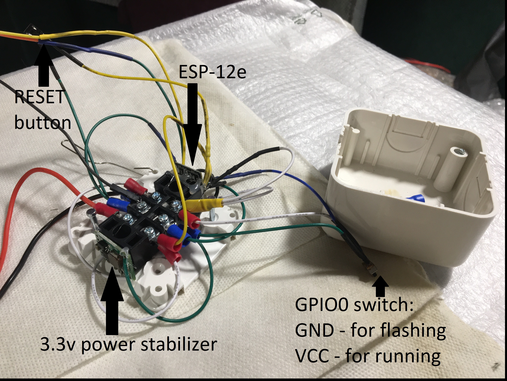

# WiFi-enabled voltmeter based on ESP8266 (esp-12e/f) (RTOS SDK variant)



## Installation

Install toolchain for crosscompiling (may not be easy, old esp-open-sdk toolchain works fine despite of warnings):
- supported toolchain version is 1.22.0-92-g8facf4c
- supported compiler version 5.2.0

```
export PATH=~/esp-open-sdk/xtensa-lx106-elf/bin:$PATH

cd ~
wget https://github.com/espressif/ESP8266_RTOS_SDK/releases/download/v3.3/ESP8266_RTOS_SDK-v3.3.zip
unzip ESP8266_RTOS_SDK-v3.3.zip
mkdir -p ESP8266_RTOS_SDK/voltmeter/main
```

Review and update defines in voltmeter.c

```
cp voltmeter.c ESP8266_RTOS_SDK/voltmeter/main
cp ESP8266_RTOS_SDK/examples/get-started/project-template/Makefile ESP8266_RTOS_SDK/voltmeter
Edit ESP8266_RTOS_SDK/voltmeter/Makefile
touch ESP8266_RTOS_SDK/voltmeter/main/component.mk

export IDF_PATH=~/ESP8266_RTOS_SDK

make menuconfig # to produce sdkconfig
```

Set menuconfig->Component config->PHY->vdd33_const value according to 
https://docs.espressif.com/projects/esp8266-rtos-sdk/en/latest/api-reference/peripherals/adc.html
Default is 33 meaning that the actual VCC will be used as a reference voltage.

```
make
```

## Wiring
- VCC to 3.3V
- GND to ground
- EN, GPIO2 to 1 via 10K pull up resister
- GPIO15 to 0 via 10K pull down resister
- RX to TX (3.3v levels)
- TX to RX (3.3v levels)
- RST to GND to reset if needed without a pull-down resistor
- ADC to a voltage divider in kOhm range; 
 
For example, to measure 12V I use 200 Ohm from ADC to ground and 3.3kOhm from 12V to ADC, which gives a nominal ratio 16.5 (12V / 16.5 = 0.72V on ADC pin (1.0V is max!). 

To account for the actual ratio, the voltmeter needs a calibration using a digital voltmeter to calculate and adjust the nominal ratio - 
see VOLTAGE_DIVIDER_RATIO define in voltmeter.c file.

Power off, ground GPIO0 via 10K pull down resister before flashing, power on.

```
make flash
```

Power off, GPIO0 to VCC via 10K pull-up resistor for normal operation, power on.

Run terminal emulator to see the ESP_LOGx(TAG,) messages:

```
miniterm --raw /dev/ttyAMA1 74880
```
Alternatively, see them in a remote logging server - details are below.

## Operation

The voltmeter in theory is capable of 10MHz voltage collection rate depending on the CLOCK_DIVIDER define (see above), which ranges from 8 to 32.

This allows to use the voltmeter as a very cheap osciloscope capable of measuring signal frequencies of up to 10Mhz.

The measured voltage is actually collected using a time series database (rrdtool) exposed via inetd daemon. For example,

```
rrdtool create /var/rrd/voltage.rrd \
          --step 60s \
          DS:voltage:GAUGE:60:10:16 \
          RRA:AVERAGE:0.5:1m:1d \
          RRA:AVERAGE:0.5:1h:1M \
          RRA:AVERAGE:0.5:1d:10y \
          RRA:MIN:0.5:1m:1d \
          RRA:MIN:0.5:1h:1M \
          RRA:MIN:0.5:1d:10y \
          RRA:MAX:0.5:1m:1d \
          RRA:MAX:0.5:1h:1M \
          RRA:MAX:0.5:1d:10y

vi /etc/inetd.conf
0.0.0.0:rrdsrv stream tcp nowait rrd /usr/bin/rrdtool rrdtool - /var/rrd

service inetd reload
```

## OTA software update

As usual, over-the-air software update is supported. See voltmeter.c file for details. Basically, just build a new image and host it on a web server. The voltmeter will download it and update itself.

## Remote logging

Same is true for remote logging. The simplest logging server can be defined as an openrc service like that:

```
#!/sbin/openrc-run

name=${RC_SVCNAME}
description="Logging daemon"
command="nc"
command_args="-ulkn 0.0.0.0 6666"
command_user="root:root"
supervisor=supervise-daemon
respawn_delay=5
respawn_max=0
supervise_daemon_args="--stdout /var/log/voltmeter.log"
umask=0027
pidfile="/run/${RC_SVCNAME}.pid"
command_background="yes"
output_logger="/usr/bin/logger"

depend() {
  need net
}
```
